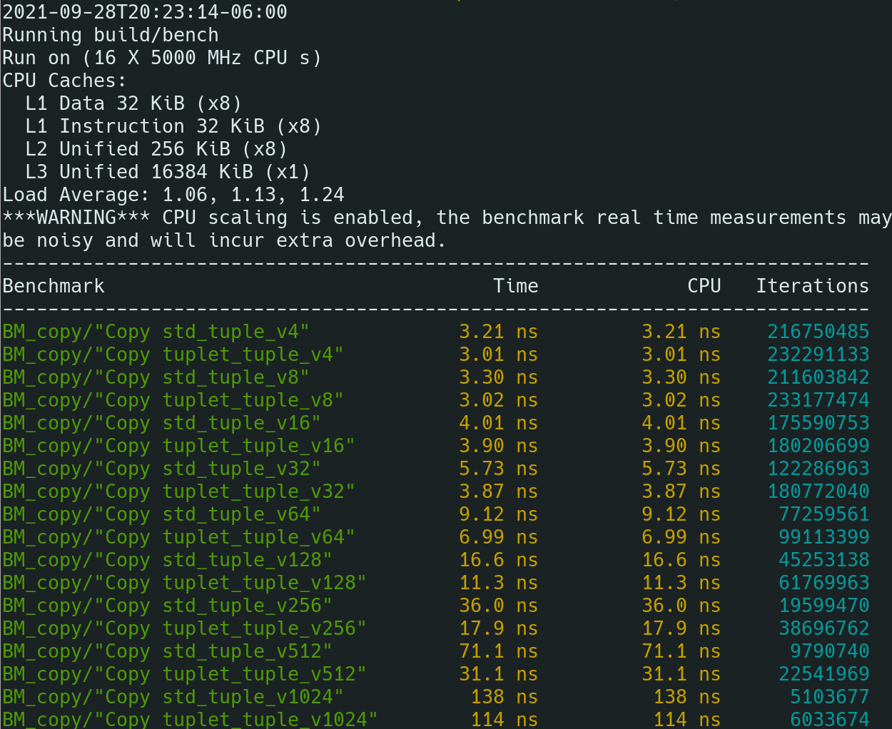
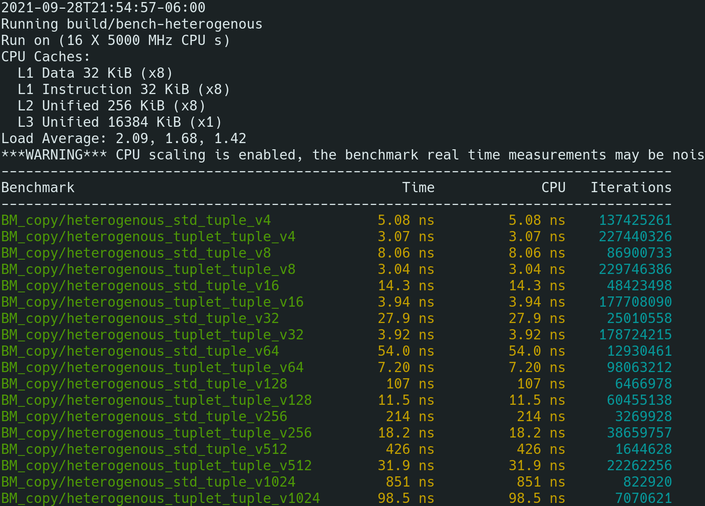

# tuplet: A Lightweight Tuple Library for Modern C++

**tuplet** is a one-header library that implements a fast and lightweight tuple
type, `tuplet::tuple`, that guarantees performance, fast compile times, and a
sensible and efficent data layout. A `tuplet::tuple` is implemented as an
aggregate containing it's elements, and this ensures that it's

- trivially copyable,
- trivially moveable,
- trivially assignable,
- trivially constructible,
- and trivially destructible.

This results in better code generation by the compiler, allowing `tuplet::tuple`
to be passed in registers, and to be serialized and deserialized via `memcpy`.

What's more, the implementation of `tuplet::tuple` is less than one fifth the
size of `std::tuple`, both in terms of lines, and in terms of kilobytes of code.
`tuplet.hpp` clocks in at 300 odd lines, compared to 1724 lines for gcc 9's
implementation of `std::tuple`.

If you'd like a further discussion of how `tuplet::tuple` compares to
`std::tuple` and why you should use it, see the [Motivation](#Motivation)
section below!

## Usage

Creating a tuple is as simple as `1, 2, "Hello, world"`! Writing

```cpp
tuplet::tuple tup = {1, 2, std::string("Hello, world!")};
```

Will create a tuple of type `tuple<int, int, std::string>`, just like you'd
expect it to. This is all you need to get started, but the following sections
will expand upon the functionality provided by **tuplet** in greater depth.

### Access members with _get()_ or the index operator

You can access members via `get`:

```cpp
std::cout << get<2>(tup) << std::endl; // Prints "Hello, world!"
```

Or via `operator[]`:

```cpp
using tuplet::tag;
std::cout << tup[tag<2>()] << std::endl; // Prints "Hello, world!"
```

Something that's important to note is that `tag` is just an alias for
`std::integral_constant`:

```cpp
template <size_t I>
using tag = std::integral_constant<size_t, I>;
```

### Use Index Literals for Clean, Easy Access

You can access elements of a tuple very cleanly by using the `_tag` literal
provided in `tuplet::literals`! This namespace defines the literal operator
`_tag`, which take number and produce a `tuplet::tag` templated on that number,
so `0_tag` evaluates to `tuplet::tag<0>()`, `1_tag` evaluates to
`tuplet::tag<1>()`, and so on!

```cpp
using namespace tuplet::literals;

tuplet::tuple tup = {1, 2, std::string("Hello, world!")};

std::cout << tup[0_tag] << std::endl; // Prints 1
std::cout << tup[1_tag] << std::endl; // Prints 2
std::cout << tup[2_tag] << std::endl; // Prints Hello World
```

### Decompose tuples via Structured Bindings

The tuple can also be accessed via a structured binding:

```cpp
// a binds to get<0>(tup),
// b binds to get<1>(tup), and
// c binds to get<2>(tup)
auto& [a, b, c] = tup;

std::cout << c << std::endl; // Print "Hello, world!"
```

### Tie values together with _tuplet::tie()_

You can create a tuple of references with `tuplet::tie`! This function acts just
like `std::tie` does:

```cpp
int a;
int b;
std::string s;

// Creates a tuplet::tuple<int&, int&, std::string&>
tuplet::tuple tup = tuplet::tie(a, b, s);

// a will be set to 1,
// b will be set to 2, and
// s will be set to "Hello, world!"
tup = tuplet::tuple{1, 2, "Hello, world!"};

std::cout << s << std::endl; // Prints Hello World
```

### Assign Values via _tuple.assign()_

It's possible to easily and efficently assign values to a tuple using the
`.assign()` method:

```cpp
tuplet::tuple<int, int, std::string> tup;

tup.assign(1, 2, "Hello, world!");
```

### Store references using _std::ref()_

You can use `std::ref` to store references inside a tuple!

```cpp
std::string message;

// t has type tuple<int, int, std::string&>
tuplet::tuple t = {1, 2, std::ref(message)};

message = "Hello, world!";

std::cout << get<2>(t) << std::endl; // Prints Hello, world!
```

You can also store a reference by specifying it as part of the type of the
tuple:

```cpp
// Stores a reference to message
tuplet::tuple<int, int, std::string&> t = {1, 2, message};
```

These methods are equivilant, but the one with `std::ref` can result in cleaner
and shorter code, so the template deduction guide accounts for it.

### Use elements as function args with _tuplet::apply()_

As with `std::apply`, you can use `tuplet::apply` to use the elements of a tuple
as arguments of a function, like so:

```cpp
// Prints arguments on successive lines
auto print = [](auto&... args) {
    ((std::cout << args << '\n') , ...);
};

apply(print, tuplet::tuple{1, 2, "Hello, world!"});
```

## Installation

### CMake package
Tuplet can now be installed as a CMake package!

```bash
git clone https://github.com/codeinred/tuplet.git
cd tuplet
cmake -B build -DCMAKE_INSTALL_PREFIX="/path/to/install"
cmake --build build
cmake --build build --target install
```

If you're installing tuplet globally, you may have to run the final command with
sudo:

```bash
# Global install
git clone https://github.com/codeinred/tuplet.git
cd tuplet
cmake -B build
cmake --build build
sudo cmake --build build --target install
```

This will attempt to build tests. If the default system compiler doesn't support
C++20 and buliding fails, you can use an alternative compiler by specifying
`-DCMAKE_CXX_COMPILER` during the configuration step:

```bash
cmake -B build -DCMAKE_CXX_COMPILER=g++-11
```

Alternatively, on newer versions of CMake (e.g, cmake 3.15 and above), you can
skip the build step entirely.
[See this documentation for more information.](https://cmake.org/cmake/help/v3.15/manual/cmake.1.html#install-a-project)

```bash
git clone https://github.com/codeinred/tuplet.git
cd tuplet
cmake -B build
sudo cmake --install build
# Or:
cmake --install build --prefix "/path/to/install"
```

Once tuplet is installed, it can now be discovered via `find_package`, and
targeted via `target_link_libraries`. It's a header-only library, but this will
ensure that tuplet's directory is added to the include path.

```cmake
cmake_minimum_required(VERSION 3.14)

project(my_project LANGUAGES CXX)

find_package(tuplet REQUIRED)

add_executable(main)
target_sources(main PRIVATE main.cpp)
target_link_libraries(main PRIVATE tuplet::tuplet)
```

### Conan package
You can install `tuplet` using the [Conan](https://conan.io/) package manager.  
Add `tuplet/1.2.2` to your `conanfile.txt`'s `require` clause.  
This way you can integrate `tuplet` with any [build system](https://docs.conan.io/en/latest/reference/generators.html) Conan supports.

## Motivation

This section intends to address a single fundamental question: _Why would I use
this instead of `std::tuple`?_

It is my hope that by addressing this question, I might explain my purpose for
writing this library, as well as providing a clearer overview of what it
provides.

`std::tuple` is _not_ a zero-cost abstraction, and using it introduces a runtime
penalty in comparison to traditional aggregate datatypes, such as structs.
`std::tuple` also compiles slowly, introducing a penalty on libraries that make
extensive use of it.

`tuplet::tuple` has none of these problems.

- `tuplet::tuple` an aggregate type.
  - When the elements are trivially constructible, `tuplet::tuple` is trivially
    constructible
  - When elements are trivially destructible, `tuplet::tuple` is trivially
    destructible
- `tuplet::tuple` can be passed in the registers. This means that there's's no
  overhead compared to a struct
- Compilation is much faster, especially for larger or more complex tuples.

  This occurs because `tuplet::tuple` is an aggregate type, and also because
  indexing was specifically designed in a way that allowed for faster lookp of
  elements.

- `tuplet::tuple` takes advantage of empty-base-optimization and
  `[[no_unique_address]]`. This means that empty types don't contribute to the
  size of the tuple.

### Can `std::tuple` be rewritten to have these properties?

Not without both an ABI break and a change to it's API. There are a few reasons
for this.

- The memory layout of `std::tuple` tends to be in reverse order when compared
  to a corresponding struct containing the same types. Fixing this would be an
  ABI break.
- Because `std::tuple` isn't trivially copyable and isn't an aggregate, it tends
  to be passed on the stack instead of in the registers. Fixing this would be an
  ABI break.
- [The constructor of `std::tuple` provides overloads for passing an allocator to the constructor](https://en.cppreference.com/w/cpp/utility/tuple/tuple).
  Given that `std::tuple` _should_ allocate on the stack, I don't know why this
  was put into the standard.

Having an allocator makes sense for a type like `std::vector`, which was
designed for use even in ususual memory-constrained situations, but in my
opinion, `std::tuple` would have been better off with an API that was as simple
as possible.

I hope that either a future version of C++ introduces epochs (or a similar
feature), which would allow for a re-write of `std::tuple`; or that some future
version introduces a language-level tuple construct, rendering `std::tuple`
obsolete in it's entirety.

**Other weird std::tuple facts:** When using the MSVC standard library
implementation, `std::tuple` won't even necessarily have the same size as a
struct with the same member types. This caused a compile error when I introduced
a `static_assert` that (incorrectly) assumed `std::tuple` would be sensibly
sized. I had to disable the `static_assert` for MSVC:

```cpp
// In bench-heterogenous.cpp
using hetero_std_tuple_t = std::tuple<int8_t, int8_t, int16_t, int32_t>;
using hetero_tuplet_tuple_t = tuplet::tuple<int8_t, int8_t, int16_t, int32_t>;

// For some reason this doesn't apply in windows
#ifndef _MSC_VER
static_assert(sizeof(hetero_std_tuple_t) == 8, "Expected std::tuple to be 8 bytes");
#endif
static_assert(sizeof(hetero_tuplet_tuple_t) == 8, "Expected tuplet::tuple to be 8 bytes");
```

Needless to say, being an aggregate type, `tuplet::tuple` does not suffer from
this problem.

## Benchmarks

The compiler is signifigantly better at optimizing memory-intensive operations
on `tuplet::tuple` when compared to `std::tuple`, with a measured speedup of
2x when copying vectors of 256 elements, and a speedup up 2.25x for vectors of
512 elements containing homogenous tuples (tuples where all types are identical,
test size 8 bytes per element).



Furthermore, for tuples containing more than one type of element (heterogenous
tuples, test size 8 bytes per element), speedups as large as 13.35x were
observed with `tuplet::tuple` when compared to `std::tuple`!



In these benchmarks, the `v<n>` suffix measures the time to copy a vector
containing _n_ elements, each of which is a tuple. You can view the code in the
`bench/` folder of the repository. It uses the Google Benchmark library.

**Why the speedup?** As stated before, `tuplet::tuple` is an aggregate type.
This means that the compiler is better able to judge what type of optimizations
it's allowed to do. In the case of the copy benchmarks, the compiler is able to
implement the copy operation using an memcpy-like operation for `tuplet::tuple`.
This can't be done for `std::tuple`, however, because `std::tuple` isn't an
aggregate type, and isn't trivially copyable.

To run the benchmarks on your local machine, simply clone and build the project
with a compiler that supports C++20:

```bash
git clone https://github.com/codeinred/tuplet.git
cd tuplet
cmake -B build -G Ninja -DCMAKE_BUILD_TYPE=Release
cmake --build build
build/bench
```
